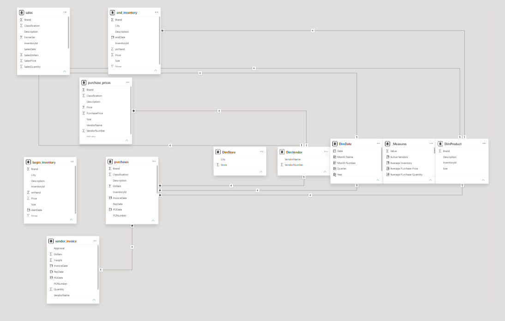
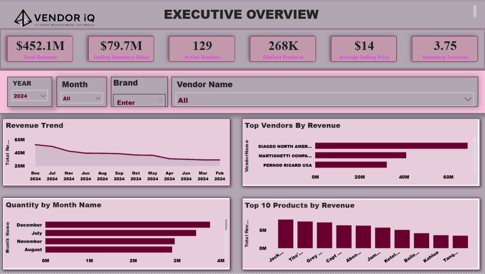

# VendorIQ — Vendor & Inventory Analytics

End-to-end retail analytics project: raw transactional data → SQL business logic → statistical validation → Power BI executive dashboard. Built around a single question senior leadership actually asks — *our top vendors are profitable, but which ones are quietly bleeding margin, and how much capital is stuck in inventory that isn't moving?*

## The Business Problem

A multi-store liquor retail business tracks purchasing, sales, and inventory across 129 vendors and 268K products, but each of those areas is analyzed in isolation. Leadership has no single, statistically validated view of which vendors actually drive profit, whether bulk purchasing is worth it, or how much working capital is tied up in slow-moving stock. Full write-up: [05_Documentation/business_conclusion_report.pdf](05_Documentation/business_conclusion_report.pdf).

## What's in this repo

```
VendorIQ-Analytics/
├── README.md
├── LICENSE
├── .gitignore
│
├── 01_Dataset/
│   ├── begin_inventory.csv, end_inventory.csv, purchases.csv,
│   │   purchase_prices.csv, sales.csv, vendor_invoice.csv     (6 tables, ~15.6M rows)
│   └── Data_Dictionary.md                                     (schema + known data quality notes)
│
├── 02_SQL/
│   └── Business_Solution.sql                                  (48 business questions — vendor, brand,
│                                                                 purchasing, inventory, profitability, trends)
│
├── 03_Python/
│   ├── Exploratory_Data_Analysis.ipynb                        (cleaning, missing values, dtype fixes)
│   └── Statistical_Analysis.ipynb                              (correlation, distribution, outliers,
│                                                                 hypothesis testing, confidence intervals)
│
├── 04_PowerBI/
│   ├── VendorIQ_Dashboard.pbix                                (3-page executive dashboard)
│   ├── Executive_Overview.png
│   ├── Vendor & Procurement Analytics.png
│   └── Inventory & Product Analytics.png
│
└── 05_Documentation/
    └── business_conclusion_report.pdf                          (full report — objectives, SQL/EDA/stats
                                                                   summary, dashboards, insights, recommendations)
```

## Data Model

<p align="center">
  
</p>

Six transactional tables (`sales`, `purchases`, `purchase_prices`, `begin_inventory`, `end_inventory`, `vendor_invoice`) are modeled into a star schema — `DimDate`, `DimVendor`, `DimStore`, `DimProduct` surrounding a `Measures` fact table — to power the Power BI dashboard. See [01_Dataset/Data_Dictionary.md](01_Dataset/Data_Dictionary.md) for column-level definitions.

## Dashboard

Three pages built off `04_PowerBI/VendorIQ_Dashboard.pbix`:

1. **Executive Overview** — top-line revenue, inventory value, active vendors, turnover
   <p></p>

2. **Vendor & Procurement Analytics** — purchase cost trend, vendor spend concentration, average price/quantity
   <p></p>

3. **Inventory & Product Analytics** — beginning/ending inventory value, top products by stock and sales, vendor revenue share
   <p></p>

## Key Findings

Full detail with every number in [05_Documentation/business_conclusion_report.pdf](05_Documentation/business_conclusion_report.pdf). Headlines:

- **Revenue and profit are concentrated among a small group of vendors** — 15 vendors (12% of the supplier base) drive 37.73% of total revenue; 7 underperformers contribute only 0.02%.
- **Bulk purchasing significantly lowers unit cost** — orders of 10+ units average $9.85/unit vs. $14.62/unit for smaller orders (Mann–Whitney U, p < 0.001), a 32.6% reduction.
- **High-performing vendors sustain meaningfully higher margins** — 36.88% vs. 29.63% for the rest of the supplier base (p < 0.001).
- **901 products (9.33%) are high-value inventory outliers**, tying up $44.85M in working capital — led by premium spirits brands.
- Reliable, large-sample benchmarks: **30.55% average vendor profit margin** (95% CI: 29.43%–31.67%) and **$12.05 average purchase price** (95% CI: $12.03–$12.07).

## Tech Stack

SQL Server (T-SQL) · Python (pandas, SciPy, matplotlib/seaborn) · Power BI
